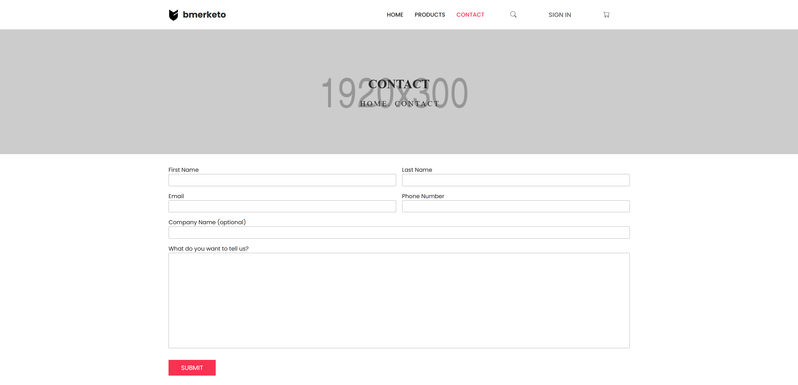

# bmerketo-webshop

A mock webshop created with ASP NET Core and Entity Framework Core as part of my ASP.NET course. 

## About

The database was set up using a code first approach with Entity Framework Core and SQL Server (but can be used with any SQL server). The website uses ASP NET Core identity to handle users and user roles. 
The website comes with a seed file that seeds all categories, tags and 100+ products. The first user to sign up is automatically made into an admin. The admin can then add more admins if they wish.

### Home Page

|  |  |
|:---:|:---:|

The home page consists of five partials. A jumbotron showing a random product with the "featured" tag, a collection of products with the "best collection" tag, an on sale section, a top seller section and a newsletter form.

### Products Page

 

The products page is where you can view all products. There is a menu where you can choose to filter by both tags (featured, on sale etc) and categories (computers, software etc). When a product is clicked you will be taken
to the individual products page. The page also includes pagination both in the URL and with buttons at the bottom of the page.

### Individual Product Page 

 

### Contact Page 

 

### Account Pages 
|  |  |
|:---:|:---:|

 

### Admin

## How To Run
